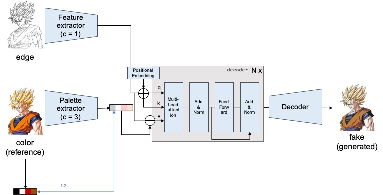

# Sketch-Colorization-Transformer
Reference-based Sketch Colorization via Palette Transformer
</img>

## Example Results
### Colorized Results
</img>

From top to bottom, input sketch images, generated colorization images, GT images, GT palettes and generated palettes.

## Usage
### Prerequisites
- Python 3.6
- Pytorch 1.8.0
- TorchVision 0.6.1
- scikit-image
- scikit-learn
- scipy
- numpy

### Getting Started
#### Installation
Clone this repo:
```bash
git clone https://github.com/SuhyeonHa/Sketch-Colorization-Transformer
cd Sketch-Colorization-Transformer
```
#### Dataset
- [Anime Sketch Colorization Pair](https://www.kaggle.com/ktaebum/anime-sketch-colorization-pair)
- Put palette data file [palette_db_8](https://drive.google.com/file/d/1Y5A6L72Xv62bLoP_G1tqZ87JkMYrJ25o/view?usp=sharing) in sketch-pair/palette/8. 8 means the number of cluster.

#### Model Training
```bash
train.py --train_dir D:\Dataset\sketch-pair --test_sketch_dir D:\Dataset\sketch-pair/val --test_ref_dir D:\Dataset\sketch-pair/val
```
I implemented visdom to check out testing images while training and I recommend you to use it.
Howerver, if you don't want to, comment `# Visdom for test visualization` and `# Visualization for test images` parts.

## Acknowledgements
Our implementation is based on
- [Reference-Based-Sketch-Image-Colorization](https://github.com/UdonDa/Reference-Based-Sketch-Image-Colorization)
- [Anime-Sketch-Colorizer](https://github.com/delta6189/Anime-Sketch-Colorizer)
